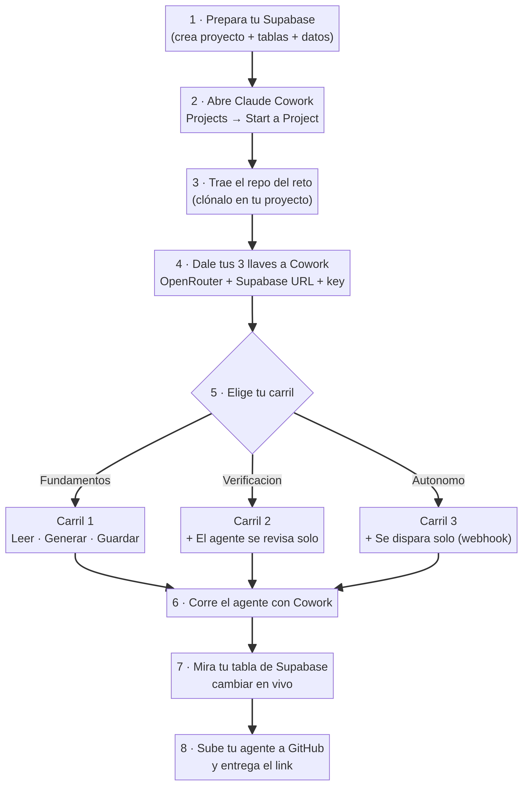

# 🚀 Tu agente en Cowork — Guía para copiar y pegar

### Hackathon S4 · "El Agente Autónomo"

> **Cómo usar esta guía:** vas a copiar los textos en **cajas grises** y pegarlos en **Cowork**, uno por uno. Cowork hace el código; tú lo diriges. Después de cada paso te digo qué **deberías ver ✅**.
>
> No necesitas saber programar. Necesitas saber **pedir bien**.
>
> **Empezamos desde cero:** crear tu base de datos, **iniciar tu proyecto en Claude Cowork** (`Start a Project`) y, ya dentro, construir el agente.

---

## 🗺️ El mapa del viaje



---

## 🎒 Lo que necesitas tener a la mano

| | Qué | Dónde sacarlo |
|---|---|---|
| 🔑 | **Llave de OpenRouter** | [openrouter.ai](https://openrouter.ai) → *Keys* → *Create Key* |
| 🗄️ | **Llave + URL de Supabase** | [supabase.com](https://supabase.com) → *New project* → *Settings* → *API* |

> ⏱️ Crear el proyecto de Supabase tarda ~2 min en ponerse "verde". Hazlo primero.

---

# PASO 1 · Prepara tu base de datos (en Supabase, no en Cowork)

1. Entra a [supabase.com](https://supabase.com) → **New project** (nómbralo `mi-agente-s4`).
2. Cuando esté verde, ve a **SQL Editor → New query**.
3. Abre el archivo [`reference_solution/supabase/schema.sql`](reference_solution/supabase/schema.sql) del repo, copia todo, pégalo y dale **Run**.
4. **New query** otra vez. Abre [`reference_solution/supabase/seed.sql`](reference_solution/supabase/seed.sql), copia, pega y **Run**.
5. Ve a **Settings → API** y ten a la vista tu **Project URL** y tu **service_role key**.

> ✅ **Deberías ver:** en *Table Editor → cuentas*, 7 empresas (Grupo Meridian, Logística Aurora, etc.).

---

# PASO 2 · Inicia tu proyecto en Claude Cowork

> Cowork está en la **app de escritorio de Claude** (Mac o Windows), no en el navegador. Necesitas un plan de pago (Pro/Max/Team).

1. Abre la **app de Claude Desktop**.
2. Arriba, junto a "Chat", haz clic en la pestaña **Cowork**.
3. En la barra izquierda, entra a **Projects** y haz clic en **+ → Start a Project** (empezar de cero).
4. Nómbralo **`Hackathon S4`**. Cuando te pida **carpeta**, crea/elige una carpeta vacía en tu compu (ej. `Documentos/Hackathon-S4`) — ahí vivirá tu agente.
5. (Opcional pero recomendado) En **instrucciones del proyecto**, pega:
   ```text
   Estoy en el Hackathon S4 del curso Claude para Productividad. Voy a construir un agente que orquesta APIs (OpenRouter + Supabase). Explícame cada paso en lenguaje simple antes de ejecutarlo y nunca subas mis API keys a GitHub.
   ```
6. Dentro del proyecto, haz clic en **New task** para empezar a trabajar.

> ✅ **Deberías ver:** un proyecto "Hackathon S4" abierto, con una carpeta conectada y una caja para escribir tu primera tarea.

---

# PASO 3 · Trae el reto a Cowork

En tu nueva tarea, copia esto 👇

```text
Clona este repositorio público y muéstrame su estructura de carpetas:
https://github.com/nabolom/curso-claude-productividad-s4.git

Quiero trabajar en la carpeta "starters". Explícame en una frase qué hay en cada subcarpeta.
```

> ✅ **Deberías ver:** Cowork lista las carpetas `starters/carril1_fundamentos`, `carril2_verificacion`, `carril3_autonomo`, etc.

---

# PASO 4 · Dale tus llaves a Cowork

Copia esto y **reemplaza con TUS valores** 👇

```text
Guarda estas credenciales como variables de entorno para esta sesión y NO las subas nunca a GitHub:

OPENROUTER_API_KEY = sk-or-...........(tu llave)
SUPABASE_URL = https://.............supabase.co
SUPABASE_KEY = eyJ............(tu service_role key)

Confírmame que quedaron cargadas, sin mostrarlas completas.
```

> ✅ **Deberías ver:** Cowork confirma que las variables están listas (sin imprimir las llaves completas).

---

# PASO 5 · Elige tu carril y construye

Copia **solo el bloque de tu carril** 👇

### 🟢 Carril 1 — Fundamentos (si es tu primera vez con APIs)

```text
Abre starters/carril1_fundamentos/agente.js. Tiene 4 comentarios "// TODO".
Complétalos conmigo UNO POR UNO, y antes de escribir cada uno explícame en lenguaje simple qué hace.

El agente debe:
1) leer de Supabase las cuentas con estatus "pendiente",
2) saltar las que llevan menos de 30 días sin contacto,
3) generar un mensaje de reactivación con Claude para las demás,
4) guardar el mensaje y marcar la cuenta como "contactado" en Supabase.
```

### 🟡 Carril 2 — Verificación (si ya conectaste una API antes)

```text
Abre starters/carril2_verificacion/agente.js. Tiene 3 "// TODO".
Quiero que, además de generar el mensaje, el agente SE VERIFIQUE solo:
- primero un chequeo GRATIS con código (máximo de palabras + frases prohibidas como "lamentamos profundamente"),
- si pasa, que un modelo barato (Claude Haiku) juzgue el tono,
- si falla, que reintente usando el feedback.
Guíame TODO por TODO y explícame por qué esto ahorra dinero.
```

### 🔴 Carril 3 — Autónomo (si quieres el sistema completo)

```text
Ya tengo mi agente del Carril 2 funcionando.
Ahora quiero que se dispare SOLO, sin que yo lo ejecute a mano.
Usa starters/carril3_autonomo/webhook.js para levantar un webhook local que ejecute mi agente al recibir un POST.
Luego ayúdame a dispararlo con curl y a comprobar que funcionó.
```

> ✅ **Deberías ver:** Cowork va completando el código y te explica cada parte. Pregúntale lo que no entiendas.

---

# PASO 6 · Córrelo y míralo cambiar

Copia esto en Cowork 👇

```text
Ejecuta el agente y muéstrame la salida completa.
Después dime exactamente qué filas cambiaron en mi tabla "cuentas" de Supabase y por qué.
```

Ahora abre tu **Supabase → Table Editor → cuentas** y refresca.

> ✅ **Deberías ver:** las **4** cuentas de +30 días (incluida **Grupo Meridian**) ahora dicen `contactado` y tienen un mensaje guardado. Las 3 recientes siguen en `pendiente`. **Tu agente decidió solo.**

---

# PASO 7 · Entrega tu trabajo

Copia esto en Cowork 👇

```text
Sube mi agente.js terminado a un repositorio NUEVO en mi cuenta de GitHub
(hazlo público), y dame el link para entregarlo.
```

> ✅ **Deberías ver:** un link tipo `github.com/tu-usuario/mi-agente-s4`. Ese es tu entregable.

---

## 🆘 Si algo se rompe — díselo a Cowork tal cual

| Si ves... | Pégale a Cowork esto |
|---|---|
| Un error rojo | `Me salió este error: [pega el error completo]. ¿Qué significa y cómo lo arreglo?` |
| `401` o `Unauthorized` | `Creo que mi API key está mal. Revisa que esté bien copiada, sin espacios ni saltos de línea.` |
| `0 cuentas` / no pasa nada | `Muéstrame qué cuentas hay y cuántos días lleva cada una. Creo que el filtro de 30 días está mal.` |
| No conecta a Supabase | `Verifica que SUPABASE_URL y SUPABASE_KEY estén bien cargadas y que la tabla "cuentas" exista.` |

> 🎯 **La regla de oro del curso:** cuando te atores, **copia el error y pégaselo a tu agente**. Saber desatorarte así vale más que memorizar código.

---

## 🔄 ¿Quieres volver a probar desde cero?

Pégale esto a Cowork:

```text
Resetea mi base: pon todas las cuentas en estatus "pendiente" y borra los mensajes generados,
para correr el agente otra vez desde limpio.
```

---

## 🏁 ¿Terminaste? Checklist

- [ ] 🟢 Las 4 cuentas de +30 días quedaron en `contactado`.
- [ ] 🟡 La columna `verificado` está en `true` (si hiciste Carril 2+).
- [ ] 🔴 Disparaste el agente con un webhook, no a mano (Carril 3).
- [ ] 📂 Subiste tu agente a GitHub y tienes el link.

**¡Eso es Loop Engineering!** Tu agente ejecuta, se verifica, recuerda y se dispara solo. 🎉
