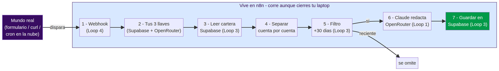

# 🟣 RUTA C (Experto) — Tu agente vive en la nube con n8n

### Hackathon S4 · El reto estrella

> **Esto es solo para quien ya terminó su carril (1, 2 o 3) y quiere volar más alto.** No es necesario para aprobar el reto. Aquí construyes la versión más poderosa: un agente que **vive en un servidor (n8n)** y **despierta solo desde internet**, aunque cierres tu laptop.

---

## 🤔 ¿Qué cambia respecto a lo que ya hiciste?

Hasta ahora tu agente corría **mientras tu compu estaba despierta** (en Cowork). En la Ruta C, el agente vive en **n8n** —una herramienta visual de automatización en la nube— y lo dispara un **webhook**: una URL pública que, cuando alguien la "toca" (un formulario, otro sistema, o un horario), **despierta tu agente sin que tú hagas nada**.

> Es la materialización real del **Loop 4 (Trigger)**: el sistema que se ejecuta solo.



---

## 🎒 Lo que necesitas

| | Qué | ¿Cuesta? | Dónde |
|---|---|---|---|
| ☁️ | **Cuenta de n8n Cloud** | Gratis (prueba) | [n8n.io](https://n8n.io) → *Sign up* |
| 🗄️ | Tu **Supabase** (URL + service_role key) | Gratis | La misma de tu carril |
| 🧠 | Una **OPENROUTER_API_KEY** | ~unos centavos | [openrouter.ai](https://openrouter.ai) → *Keys* |
| 📄 | El archivo `integrations/n8n/RUTA_C_workflow_alumno.json` | — | Está en este repo |

> ⚠️ A diferencia de las Rutas A y B, esta **sí usa OpenRouter** (el cerebro vive en n8n, y n8n llama al modelo por API). Pon un **límite de gasto bajo** ($2-3) en OpenRouter → *Settings → Limits*.

---

# PASO 1 · Crea tu cuenta de n8n Cloud

1. Entra a **[n8n.io](https://n8n.io)** y haz clic en **Get started / Sign up**.
2. Crea tu cuenta (correo + contraseña). Elige la opción **n8n Cloud** (la versión en la nube, no la instalación local).
3. Espera a que tu instancia esté lista (te dan una URL tipo `https://tu-nombre.app.n8n.cloud`).

> ✅ **Deberías ver:** el lienzo (canvas) vacío de n8n, listo para crear workflows.

---

# PASO 2 · Importa el workflow del reto

No vas a armarlo nodo por nodo: te dejamos el esqueleto listo.

1. Descarga del repo el archivo **`integrations/n8n/RUTA_C_workflow_alumno.json`** (ábrelo en GitHub → botón **Raw** → guarda como `.json`).
2. En n8n, arriba a la derecha, haz clic en los **tres puntos (⋮) → Import from File**.
3. Selecciona el `.json` que descargaste.

> ✅ **Deberías ver:** un workflow llamado *"Ruta C - Agente Reactivacion en la nube"* con **7 nodos** conectados en fila, empezando por un nodo **Webhook**.

---

# PASO 3 · Pega tus 3 llaves (el nodo morado)

Busca el segundo nodo: **"2. CONFIGURA AQUI tus 3 llaves"**. Haz doble clic para abrirlo. Verás tres campos con texto `PEGA_AQUI_...`. Reemplázalos:

| Campo | Qué pones | Dónde lo sacas |
|---|---|---|
| `SUPABASE_URL` | Tu Project URL | Supabase → Settings → API → *Project URL* |
| `SUPABASE_KEY` | Tu service_role key | Supabase → Settings → API → *service_role* `secret` |
| `OPENROUTER_API_KEY` | Tu llave de OpenRouter | openrouter.ai → Keys |

Cierra el nodo (los cambios se guardan solos) y dale a **Save** (arriba a la derecha).

> ✅ **Deberías ver:** los tres campos ya con tus valores (no con el texto `PEGA_AQUI`).
>
> 🔒 **Importante:** estas llaves quedan dentro de TU workflow en TU cuenta de n8n. **No subas este `.json` ya rellenado a GitHub.**

---

# PASO 4 · Activa el workflow (enciende el webhook)

1. Arriba a la derecha, mueve el switch **Inactive → Active**.
2. Haz doble clic en el primer nodo **"1. Webhook"** y copia la **Production URL** (algo como `https://tu-nombre.app.n8n.cloud/webhook/reactivacion`).

> ✅ **Deberías ver:** el workflow en estado **Active** y una URL de webhook lista para usar.

---

# PASO 5 · Dispáralo (que el agente despierte solo)

Tienes dos formas de "tocar" el webhook:

**Opción fácil (desde tu navegador / terminal):** abre una terminal y pega (reemplaza la URL por la tuya):

```bash
curl -X POST https://tu-nombre.app.n8n.cloud/webhook/reactivacion
```

**Opción "wow" (un horario en la nube):** en n8n, puedes cambiar el nodo Webhook por un nodo **Schedule Trigger** para que corra, por ejemplo, todos los días a las 9am. **Así corre aunque tu laptop esté apagada.**

> ✅ **Deberías ver:** en n8n, la pestaña **Executions** muestra una corrida en verde. Y en tu **Supabase → Table Editor → cuentas**, las cuentas de +30 días cambian a `contactado` con su `mensaje_generado`. **Nadie las tocó a mano: las despertó el webhook.**

---

# PASO 6 · Entrega tu Ruta C

En tu repo de entrega (el de GitHub), agrega:
- El `RUTA_C_workflow_alumno.json` **sin tus llaves** (déjalo con los `PEGA_AQUI`).
- Una captura de tu pestaña **Executions** en verde.
- Una línea en tu README: *"Ruta C completada: agente disparado por webhook en n8n."*

> 🏆 Si llegaste aquí, construiste un agente de **nivel producción**: vive en la nube, se dispara solo y orquesta Supabase + un modelo de IA. Eso es Loop Engineering completo.

---

## 🆘 Si algo falla

| Si ves… | Qué revisar |
|---|---|
| El webhook responde pero no cambia nada | Abre la corrida en **Executions** y mira en qué nodo se puso rojo. |
| Error `401` en el nodo de Supabase | La `service_role key` está mal pegada (espacios o incompleta). |
| Error `401`/`402` en el nodo de OpenRouter | Tu `OPENROUTER_API_KEY` está mal o sin saldo/límite. |
| `0 cuentas` procesadas | Tu tabla no tiene cuentas en estatus `pendiente`, o ninguna pasa el filtro de +30 días. Resetea con el SQL del repo. |
| El nodo "Separar" falla | Revisa que el nodo 3 (Supabase) sí devolvió filas; el campo a separar es `data`. |

> 🎯 Truco pro: en n8n puedes hacer clic en cada nodo y ver **exactamente qué dato entró y salió**. Esa es tu mejor herramienta para depurar.

---

## 🔄 Resetear para volver a probar

En tu Supabase → SQL Editor, corre:

```sql
update cuentas set estatus_agente='pendiente', mensaje_generado=null, verificado=false, intentos=0;
```

Y dispara el webhook otra vez.
